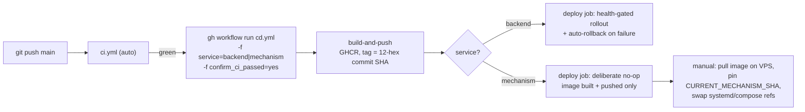

# CI/CD — from commit to running production container

> **Purpose:** the actual path a change takes from `git push` to a running VPS container, and what
> gates it at each step.
> **Source of truth:** `.github/workflows/ci.yml`, `.github/workflows/cd.yml`, `deploy/vps/deploy.sh`.
> **Last verified:** 2026-09-25, including a live re-check of the `production` GitHub Environment's
> protection rules via the API (`gh api repos/.../environments/production`) — not assumed from an
> earlier finding.

## 1. The path

## 2. `ci.yml` — automatic, every push/PR to `main`

A change-detection gate (`dorny/paths-filter`, 4 booleans: frontend / backend / mechanism / infra —
any `infra` touch reruns everything) feeds 5 jobs:

| Job | Runs when | What it checks |
|---|---|---|
| `frontend-ci` | frontend or infra changed | `tsc --noEmit`, `next lint`, an isolated production `next build` |
| `backend-ci` | backend or infra changed | Installs backend+mechanism deps (mirrors the Dockerfile), `py_compile`s + dynamically imports every router/service, `pytest backend/auth/tests backend/tests` (no DB needed) |
| `mechanism-ci` | mechanism or infra changed | Installs mechanism+ml_training+backend deps, `py_compile`s (excluding 2 legacy files with invalid-UTF8 bytes — a deliberate, documented exclusion, not an oversight), `pytest mechanism/alerts/tests mechanism/data_updaters/tests ml_training/tests` |
| `docker-validate` | always | Validates both Compose files, asserts production-safety invariants (ports 80/443 only, no schema-bootstrap mount in prod, no `.env.example` fallback, bot behind a Compose profile, every image pinned to `IMAGE_TAG`), builds (not pushes) all 3 images |
| `db-bootstrap-integration` | mechanism or infra changed | A real ephemeral Postgres; applies every migration file (discovered from `docker-compose.yml`'s own init-mount list, not a second hardcoded copy — see [DATABASE.md](DATABASE.md)), verifies table/view counts, PK/FK/sequence/grant facts, and a real FK-violation-rejection round trip; includes a dedicated `telegram_post_delivery` structure + claim/reclaim check |

## 3. `cd.yml` — manual only, never triggers on push

`workflow_dispatch` only, requiring a typed `confirm_ci_passed=yes`.

- **`build-and-push`**: tags images with exactly the 12-hex commit SHA (never `latest` in
  production) — `ghcr.io/danielbugi/wolfx_alpha-{backend,mechanism}:<sha>`.
- **`deploy`**, for `service=backend`: tars the compose files + the production Caddyfile and pipes
  them over SSH to a **forced remote command** on the VPS (`deploy backend <sha>` — the deploy
  account's key can run nothing else; see `deploy/vps/ci-entry.sh`), host-key-pinned.
  `deploy/vps/deploy.sh` then: pulls the pinned tag, brings the service up `--no-deps`, verifies the
  running image actually matches the requested tag, waits for Docker's own healthcheck, reloads
  Caddy, records `CURRENT_SHA`/`PREVIOUS_GOOD_SHA`, and prunes old release bundles (keeps 10).
  **Auto-rollback on failed health** restores `PREVIOUS_GOOD_SHA` and still exits non-zero so the
  failure stays visible.
- **`deploy`, for `service=mechanism`**: **deliberately a no-op** beyond building and pushing the
  image — starting bot/pipeline/channel-sender needs a manual, careful cutover (never a
  health-gated automatic swap, since a bad bot deploy means two long-polling processes fighting over
  one Telegram token, not just a failed HTTP health check). See
  [../operations/DEPLOYMENT.md](../operations/DEPLOYMENT.md) for the manual steps.

## 4. Backend vs. mechanism vs. frontend — three different deployment models

| | Backend | Mechanism (pipeline/bot/channel-sender) | Frontend |
|---|---|---|---|
| Built by | `cd.yml` | `cd.yml` | Vercel (its own build, triggered by its own GitHub integration — not this repo's `cd.yml`) |
| Deployed by | `cd.yml`'s `deploy` job, automatically once dispatched | A human, manually, on the VPS, after the image is pushed | Vercel automatically on push to `main` |
| Rollback | Automatic on failed health, or `deploy/vps/rollback.sh` | Manual: re-pin the previous SHA and re-run the manual steps | Vercel's own deployment history / instant rollback |
| Image tag | Immutable 12-hex commit SHA — never `latest` | Same | N/A (Vercel's own build artifact, not a Docker image here) |

## 5. Known open gap: no required reviewer on `production`

Confirmed live (re-checked 2026-09-25 via `gh api repos/danielbugi/wolfx_alpha/environments/production`):
the `production` GitHub Environment has exactly one protection rule, `branch_policy` — **no
`required_reviewers` rule exists**. `cd.yml`'s own design assumes a second, independent approval
gate on production deploys; in practice today, anyone who can dispatch the workflow and type
`confirm_ci_passed=yes` can trigger a production deploy with no second person's sign-off. This is
the single most important open CI/CD item from the 2026-09-25 audit — fixing it is a GitHub repo
settings change, not a code change (Settings → Environments → production → Required reviewers).

## 6. Dockerfiles (what actually gets built)

- **`backend/Dockerfile`**: `python:3.11-slim`, repo-root build context, installs *both*
  `backend/requirements.txt` and `mechanism/requirements.txt` (the backend imports mechanism/ml_training
  by path), no `.env` baked in, `CMD uvicorn main:app` — deliberately **no** `--reload` in the image
  (avoids a documented shutdown-hang seen with `--reload` in production).
- **`mechanism/Dockerfile`**: one shared image for the `bot`, `pipeline`, and `channel-sender`
  services. Installs `bash`/`libgomp1`/`ca-certificates`. Symlinks `.venv/Scripts/python.exe` to the
  container's real Python — a deliberate workaround so `automation_pipeline.sh` stays byte-identical
  between Windows dev and the container, not a mistake to "clean up."
- **`.dockerignore`**: `ml_training/models/*` is excluded except `*.py` (a negation pattern) — this
  is the fix for a real 2026-09-24 incident where an empty bind-mounted host directory shadowed the
  trainer source baked into the image. `ml_training/models` is mounted as a **named** Docker volume
  in `docker-compose.yml` (auto-seeds from the image on first use), not a bind mount, specifically to
  avoid reintroducing that shadowing.

## 7. Compose overlay (`docker-compose.prod.yml`) — what production changes vs. base

Uses YAML `!override`/`!reset` merge directives, confirmed exact:

- Postgres `volumes:` reset to just `postgres_data` — **production never auto-bootstraps the
  schema**; it must come from restoring a `pg_dump`.
- `backend`/`bot`/`pipeline`/`channel-sender` all get `build: !reset null` + a pinned `image:` tag +
  `env_file: !override -> .env` (real secrets only, never falls back to a committed placeholder —
  see [../dev/ENVIRONMENT.md](../dev/ENVIRONMENT.md) for why this is *not* a secret leak despite
  looking like one at first glance).
- Reverse-proxy ports reset to 80/443 only.
- `frontend` is `profiles: ["self-hosted-frontend-fallback"]` — a documented break-glass option;
  Vercel serves real production traffic, not this container.
- `pipeline` carries `mem_limit: 5g, cpus: "2.0"` — raised from 3g after a real, root-caused OOM
  incident during ML training (confirmed via the kernel's own OOM log, not guessed).
