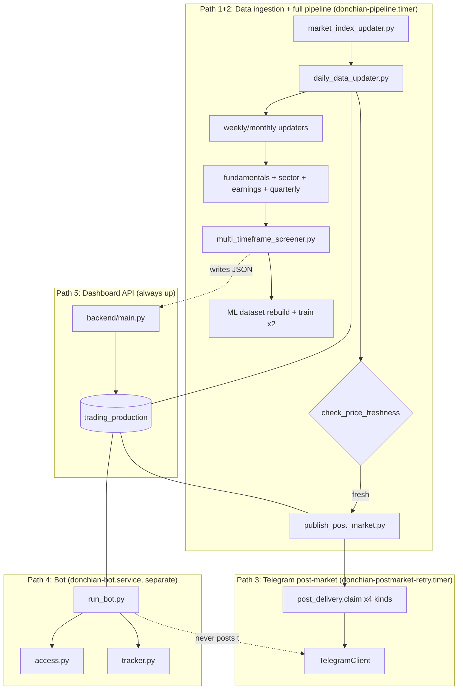

# Codebase Audit — Architecture, Reachability & Cleanup (Phase 3)

> **Purpose:** a full executable-architecture map of the codebase, evidence-based file/module
> classification, and a ranked cleanup plan — for both human developers and future AI agents working
> without this conversation's history.
> **Method:** 5 parallel research passes (backend; mechanism+ML; Telegram/bot; database+config+
> hazards; frontend+deploy/CI), each read-only, each required to cite evidence (file:line, grep
> results, or a specific test) rather than assert from filenames alone. One live, read-only VPS check
> was performed to resolve a genuine discrepancy found between two agents' reports (§9).
> **Scope discipline:** this document is audit + evidence only. No code was changed, no file was
> deleted, no production system was touched beyond one read-only `systemctl`/`docker ps` check.
> **Last verified:** 2026-09-25.

---

## 1. Executive summary

The codebase is **substantially more sound than its file count suggests** — every live production
path (backend routers, the pipeline, the post-market package, the bot, ML training) is reachable,
consistently organized, and mostly well-tested where it matters most (auth security primitives, the
Telegram delivery claim/concurrency contract, bot access control). The confusion a fresh agent would
hit is concentrated in a few well-defined places, not spread evenly:

- **A real tail of confirmed-dead code** (~30 files) sits alongside live code with no in-directory
  marker — several are not just "unused" but **structurally broken** (import a class that no longer
  exists, reference scripts that were never created, or reference the wrong path) — see §14.
- **Two genuinely new hazards found this pass**, neither previously documented: a module that opens a
  live database connection as a side effect of being imported (§15), and a duplicate schema
  definition for three ML tables living outside the tracked migration chain (§15).
- **A live, previously-undocumented production gap**: the Telegram bot's systemd service is currently
  running correctly but is `disabled` — it will not survive a VPS reboot (§9, confirmed live).
- **A latent duplicate-send bug**: `send_channel_posts.py` has its own Momentum Board sender that
  completely bypasses the `telegram_post_delivery` idempotency table — currently harmless only
  because nothing schedules that script on a trading day (§15).
- **The best-organized area is the backend** (strict 1:1 router/service naming, consistent patterns)
  and the **best-tested area is `mechanism/alerts/`** (25 test files, real concurrency tests, a
  structural test enforcing the single-Telegram-gateway rule). The **least-tested area is the
  screener and ML-serving path** — `multi_timeframe_screener.py` and `ml_signal_enhancer.py`, the two
  modules that produce the system's actual output, have zero dedicated tests.

No executable behavior was changed to produce this document. Recommended next step is a scoped,
independently-reviewable P0/P1/P2/P3 cleanup pass (§18) — not attempted here.

---

## 2. Current executable architecture



Five independent execution paths share one database (`trading_production`) — confirmed by tracing
every entrypoint below. See [SYSTEM_OVERVIEW.md](SYSTEM_OVERVIEW.md) for the higher-level version of
this diagram; this document goes one level deeper into each path's actual files.

---

## 3. Entrypoint map

| Path | Real entrypoint | Invoked by |
|---|---|---|
| Backend API | `backend/main.py` (uvicorn ASGI app) | `backend/Dockerfile`'s `CMD`, `docker-compose.yml`'s `backend` service |
| Full pipeline | `automation_pipeline.sh` | `deploy/vps/donchian-pipeline.service`'s `ExecStart=/opt/donchian/scripts/run_pipeline.sh` (wrapper script — **not in this repo**, see §15) |
| Post-market publish (inline + retry) | `mechanism/alerts/publish_post_market.py` | Called directly by `automation_pipeline.sh`; also by `donchian-postmarket-retry.service`'s `run_postmarket_retry.sh` (**not in this repo**) |
| Telegram bot | `mechanism/alerts/run_bot.py` | `donchian-bot.service`'s `ExecStart` (`docker compose --profile bot up -d bot`) |
| Earnings-today / notices | `mechanism/alerts/send_earnings_today.py`, `send_channel_notices.py` | `run_channel_sender.sh <script> --to prod --send` (**wrapper not in this repo**), called by 3 separate systemd units |
| Nightly backup | `deploy/db/nightly_backup.sh` (tracked, unlike the above) | `donchian-nightly-backup.service` |
| Frontend | `frontend/src/app/*` (Next.js file-based routing) | Vercel's own build, not this repo's CI/CD |

**Every backend router is confirmed mounted** via `main.py`'s 14 `include_router` calls (each in its
own `try/except ImportError`), **except** `routers/dashboard.py` and `routers/market_data.py`, both
confirmed 0 bytes and dead — see §14. The dashboard's real endpoints (`/api/dashboard/main-page-data`,
`top-gainers`, `top-losers`, `unusual-volume`) are defined **inline in `main.py`** (lines ~654-947),
not in a router file — a genuine reachability trap for anyone searching `routers/` by feature name.

---

## 4. Major execution paths, traced end to end

### 4.1 Dashboard request → response (Momentum Board example)

```
Frontend GET /api/momentum-board (bearer token via services/api.ts)
  -> routers/momentum_board.py (router-level Depends(require_authenticated_user))
  -> auth/dependencies.py:require_authenticated_user() — JWT decode + a REAL DB round trip
     confirming the user still exists and is_active (not just trusting JWT claims)
  -> services/momentum_board_service.py:get_board() — 300s in-process cache, else:
     digest_runs JOIN digest_stocks JOIN daily_fundamentals JOIN LATERAL earnings_calendar
  -> starring via mechanism/alerts/star.py (imported into backend via sys.path.append)
  -> JSON response
```

### 4.2 Auth flow, end to end

```
POST /api/auth/login -> AuthStore.get_user_by_email() -> bcrypt verify
  -> on success: 6-digit code + opaque challenge token, BOTH stored only as sha256 hashes
  -> auth/email_service.py: real SMTP, or dev-log fallback if SMTP_HOST unset (never fakes success)
POST /api/auth/verify-2fa -> hash-compare against stored challenge
  -> JWT access token (30min) + opaque refresh token (stored hashed, 30 days)
POST /api/auth/refresh -> new access token; refresh token itself is not rotated
Every subsequent request -> require_authenticated_user() re-verifies against the DB every time
Owner-only actions -> additionally layer require_owner()
```

### 4.3 Full pipeline, 13 steps — dependency table

| # | Step | Writes | Required for Telegram? | Required for dashboard? | ML-only? | Failure mode |
|---|---|---|---|---|---|---|
| gate | trading-day gate | `data/session_state.json` read | — | — | — | fails open |
| 1 | market index update | `market_index_prices` | No | Yes (macro strip) | No | abort |
| 2 | daily data update | `stock_prices`, `technical_indicators` | **Yes — the one real prerequisite** | Yes | No | abort |
| — | freshness check | (reads only) | Yes — gates the publish | No | No | **abort by design** (leaves session unmarked; retry timer picks it up) |
| — | **post-market publish** | `telegram_post_delivery`, `digest_stocks`, Telegram | is the Telegram step | No | No | **warn-only** |
| 3 | weekly update | `weekly_technical_indicators` | No | Partial | No | abort |
| 4 | monthly update | `monthly_technical_indicators` | No | Partial | No | abort |
| 5 | daily fundamentals | `daily_fundamentals` | No | Yes | No | abort |
| 6 | sector snapshot | `sector_performance_daily` | No | Yes | No | abort |
| 7 | earnings calendar | `earnings_calendar` | No | Partial | No | abort |
| 8 | quarterly fundamentals | `quarterly_fundamentals` | No | Yes | No | **script always exits 0** (per-symbol failures expected) |
| 9 | multi-timeframe screener | JSON files + `ml_predictions` | No | **Yes — `alpha.py` reads the JSON directly, not the DB** (architecturally inconsistent with every other router) | No | abort |
| 10 | ML dataset rebuild | `ml_breakout_dataset_v2`, `price_discontinuities` | No | No | Yes | abort (data errors only) |
| 11-12 | ML training x2 | candidate reports; `.joblib`+`ml_models` row **only if gate passes** | No | No | Yes | **exits 0 on a gate miss, by design** |
| — | session mark | `data/session_state.json` | — | — | — | only reached if 1-12 succeeded |
| 13 | post-market retry | same as inline publish | is the retry | No | No | **not run through the abort wrapper** — warns and continues |

**Confirms the documented claim exactly**: only steps 1-2 + the freshness check gate the post-market
package; steps 3-12 run *after* the publish call and cannot block it.

### 4.4 ML chain, traced

```
stock_prices -> ml_training/data_preparation/build_dataset.py (via features/price_features.py, "price_v1")
  -> ml_breakout_dataset_v2 (~595k rows)
  -> ml_training/models/momentum_predictor.py -> GATE dict + .gate() (lines 66-73, 202)
     -> NEVER PASSED: all 9 candidate reports on disk have "promoted": false; zero .joblib files
        exist anywhere in the repo (confirmed by search, both worktree and main checkout)
  -> mechanism/ml_enhancement/ml_signal_enhancer.py: globs for a model WITH a sibling _meta.json
     (models without one are skipped even if present), then additionally checks
     feature_set_version match — a second train/serve-skew guard
```

### 4.5 Bot, traced as a fully separate path from channel publishing

```
donchian-bot.service -> docker compose --profile bot up -d bot -> run_bot.py
  -> acquire_single_instance() (localhost port lock, BOT_LOCK_PORT)
  -> build_dispatcher() -> aiogram Router, PRIVATE/GROUP/OWNER_ONLY filters
  -> access.py (Access class) <-> bot_service.PgStore -> bot_access/bot_invites/bot_audit/
     bot_requests/funnel_events
  -> message handlers -> tracker.py (bot_tracked) / news_service.py (Alpaca, shared 6h cache) /
     chart.py (local render only, no external call)
```
**Structurally confirmed**: `run_bot.py` never imports `TelegramClient` and never references
`TELEGRAM_CHAT_ID`/`TELEGRAM_DEV_CHAT_ID` — the bot cannot reach the public channel through any code
path found. **However, no test enforces this** (see §8, §15) — the reverse direction (channel code
can't reach the assistant) *is* tested.

---

## 5. Module / directory classification

Legend: **ACTIVE** · **ACTIVE-SUPPORTING** · **ACTIVE-DEV** (dev/ops tooling) · **RESEARCH** ·
**DUPLICATED** · **LEGACY** (superseded, still runnable) · **DEAD** (broken or zero reachability,
evidenced) · **UNCERTAIN**.

### backend/
| Path | Class | Evidence |
|---|---|---|
| `main.py`, `routers/*` (14 mounted), `services/*` (14), `auth/*` | ACTIVE | All confirmed mounted/imported; see §3 |
| `utils.py` | ACTIVE-SUPPORTING | Used by main.py, alpha.py, stock.py, strategy.py; reads ML JSON off disk (not DB — a real, load-bearing exception to the DB-driven pattern) |
| `scripts/create_user.py` | ACTIVE-SUPPORTING | Intentional manual bootstrap/recovery tool |
| ~~`routers/dashboard.py`, `routers/market_data.py`, `models/dashboard_models.py`~~ | **REMOVED (Phase 4B)** | Were all 0 bytes; zero references repo-wide beyond CLAUDE.md's own prose |
| ~~`test_simple_queries.py`~~ | **REMOVED (Phase 4B)** | Was 0 bytes |
| `test_step1.py`, `test_step2.py`, `debug_database.py` | LEGACY | Real, runnable, manual-only; `test_step1.py` still expects the removed `/api/dashboard/top-ai-picks` endpoint |

### frontend/src/
| Path | Class | Evidence |
|---|---|---|
| All 11 routes, `services/api.ts` (sole axios client, one documented exception in `DevQAPanel.tsx`) | ACTIVE | Traced per-route in the frontend agent's report |
| ~~`components/layout/MainLayout.tsx`~~ | **REMOVED (Phase 4B)** | Was zero references; root cause found — `AuthGate.tsx` independently re-implements the identical Sidebar+MobileNav wrapper inline instead of importing it |
| `components/dev/DevQAPanel.tsx` | ACTIVE-DEV | Self-gates to inert in production builds |
| Everything else in `components/`, `lib/`, `hooks/`, `contexts/` | ACTIVE / ACTIVE-SUPPORTING | Each confirmed referenced |

### mechanism/ (excl. alerts/)
| Path | Class | Evidence |
|---|---|---|
| `data_updaters/*.py` (9 live updaters) | ACTIVE | All wired into `automation_pipeline.sh` |
| ~~`data_updaters/backups/*` (4 files), `screeners/backups/*` (3 files)~~ | **REMOVED (Phase 4B)** | Were tracked in git, zero references |
| `screeners/multi_timeframe_screener.py` | ACTIVE | The one live screener |
| ~~`screeners/donchian_screener.py`, `ml_donchian_screener.py` + their `_backup.py` twins~~ | **REMOVED (Phase 4B)** | Only referenced in comments/docstrings elsewhere, never imported. Also removed alongside these: `screeners/multi_timeframe_screener_backup.py` — listed as confirmed-dead in `codebase-map.json` but omitted from this prose table; a fresh reachability re-check (zero code references, two doc-only mentions) resolved the discrepancy before deletion. |
| `shared/*` | ACTIVE | All 7 files confirmed live |
| `diagnostic_tools/check_database_schema.py`, `test_db_connection.py`, `progress_dashboard.py` | LEGACY | Stale table names / stale paths / single-session-dated tool |
| ~~`diagnostic_tools/ml_readiness_checker.py`~~ | **REMOVED (Phase 4B)** | Had broken `sys.path` logic (assumed a directory layout that didn't exist) |
| `orchestrators/master_automation_runner.py` | LEGACY | Not wired in, but likely still functional as a manual CLI |
| `ml_generators/historical_breakouts_generator.py` | LEGACY | Writes to `breakouts`/`ml_training_data`, both stale-basis; dormant, code doesn't error |
| `ml_enhancement/ml_signal_enhancer.py` | ACTIVE | The live inference/gate-check path |
| ~~`ml_enhancement/enhance_existing_json.py`, `ml_signal_enhancer_backup.py`~~ | **REMOVED (Phase 4B)** | Imported a `MLMomentumEnhancer` class that no longer existed — would `ImportError` if run |
| ~~`atr_database_fixer.py`, `quick_analyzer.py`, `migrate_to_posresql.py`, `work_day_automation.py`~~ | **REMOVED (Phase 4B)** | `quick_analyzer.py` was CI-excluded for bad UTF-8 (that exclusion is also removed — see `.github/workflows/ci.yml`); `work_day_automation.py` referenced 4 `*_corrected.py` files that never existed anywhere in repo history |
| `symbol_scraper.py` | ACTIVE-SUPPORTING | Manual but genuinely reusable; feeds `stock_lists/` (44 tracked, real files) |
| `reports/trading_system_report_20250711_*.md` | LEGACY cruft | Tracked despite `mechanism/reports/` being gitignored — a pre-rule leftover |

### ml_training/
| Path | Class | Evidence |
|---|---|---|
| `features/price_features.py`, `data_preparation/build_dataset.py`, `models/momentum_predictor.py` | ACTIVE | The live chain |
| `features/fundamentals_features.py` (+ test) | ACTIVE-DEV | Finished, unit-tested, deliberately not yet wired in (own docstring confirms) |
| `data_preparation/momentum_labeler.py` | LEGACY | Kept alive only as a parity-test fixture (`test_price_features.py`) |
| ~~`data_preparation/feature_builder.py` + backup~~ | **REMOVED (Phase 4B)** | Had zero real imports (only comment references) |
| ~~`deployment/ml_integration.py`~~ | **REMOVED (Phase 4B)** | Was CI-excluded (invalid UTF-8); called `load_model()`, which didn't exist on the current predictor class |
| ~~`deployment/model_registry.py`~~ | **REMOVED (Phase 4B)** | A parallel, unused file-based registry — `system_health_service.py` itself documented "exists but isn't used to gate production"; created directories as an import side effect |
| ~~`training/`~~ | **REMOVED (Phase 4B)** | Was an empty placeholder package, `__init__.py` only, never populated |
| ~~`setup_ml_environment.py`~~ | **REMOVED (Phase 4B)** | One-time bootstrap generator, zero callers |
| `evaluation/performance_tracker.py` | ACTIVE (write half) / **GAP** (read half) | `record_predictions()` is live; `evaluate_predictions()`/`calculate_performance_metrics()` are only reachable via manual `__main__` invocation — see §15 |
| `scripts/ml_pipeline_runner.py` | ACTIVE-SUPPORTING | Manual CLI wrapper, accurately documents the live chain |
| `scripts/backup/*` (10 files) | Confirmed intentional archive | Matches CLAUDE.md |
| `notebooks/` | RESEARCH | No automation evidence |

### mechanism/alerts/ (73 files — see [TELEGRAM_PUBLISHING.md](TELEGRAM_PUBLISHING.md) for the architecture)
| Path | Class | Evidence |
|---|---|---|
| `telegram_client.py`, `post_delivery.py`, `publish_post_market.py`, `channel_content.py`, `send_daily_digest.py`, `digest_format.py`, `digest_builder.py`, `market_context.py`, `market_card.py`, `market_stats.py`, `channel_cards.py`, `board.py`, `deeplink.py`, `star.py`, `price_guard.py`, `snapshot.py` | ACTIVE | The post-market package core |
| `run_bot.py`, `bot_service.py`, `access.py`, `tracker.py`, `screens.py`, `insights.py`, `morning.py`, `performance.py`, `levels.py`, `news_service.py`, `chart.py` | ACTIVE | The bot, a separate path |
| `send_earnings_today.py`, `send_channel_notices.py` | ACTIVE | Separately scheduled |
| `channel_control.py`, `message_ledger.py`, `schedule.py`, `texts.py` | ACTIVE-SUPPORTING | Telegram Control Center backend |
| `channel_posts.py`, `promo_assets.py`, `dev_chat_reset.py`, `qa_live.py`, `backfill_snapshots.py` | ACTIVE-DEV | Manual tools, genuinely used, not on any schedule |
| `send_channel_posts.py`, and `channel_content.py`'s non-post-market builders (sector/macro/gaps/near_highs/aligned/base_rate/recap/news/scoreboard/promo) | **ACTIVE-DEV, effectively dormant** | Built, tested, registered — but **no systemd timer calls this script at all** on a trading day; only reachable manually or via the Sunday-only recap branch inside `automation_pipeline.sh` |
| `scoreboard.py`, `channel_news.py` | ACTIVE-SUPPORTING | Off by default (feature flags) |
| `send_daily_alerts.py`, `alert_builder.py` (except `Skip`), `message_format.py`'s `format_card`/`format_header`/`plan_summary`, `news_links.py` | LEGACY | Entry point superseded; some internals (`Skip`, `resolve_session`, `fmt_price`/`fmt_cap`) still imported live |

### deploy/, docker/, .github/workflows/
| Path | Class | Evidence |
|---|---|---|
| `deploy/vps/{ci-entry,deploy,rollback,docker-user-firewall}.sh`, `donchian-docker-firewall.service`, all 15 tracked systemd unit files | ACTIVE | Traced to real invocation |
| `deploy/vps/donchian-bot.service` | ACTIVE, **with a live caveat** | Running today but `disabled` — see §9 |
| `deploy/vps/auth_smoke.sh` | ACTIVE-SUPPORTING | Manual, referenced by `verify_restore.sh` and docs |
| `deploy/db/{nightly_backup.sh,pull_nightly_backup.ps1,verify_restore.sh}` | ACTIVE | Confirmed invoked |
| `deploy/db/donchian-nightly-backup.{service,timer}` | ~~**DUPLICATED**~~ **RESOLVED (Phase 4A)** | Was byte-identical to a copy in `deploy/vps/`; that copy was removed 2026-09-25 after re-confirming this one still matches the live VPS units via a fresh SHA-256 check. `deploy/db/` is now the single tracked location — see `deploy/db/README.md`. |
| `deploy/db/backup_production.py` | LEGACY | Docstring describes the pre-migration topology (Windows-hosts-production); superseded in direction by `nightly_backup.sh` |
| 4 root `.ps1` scripts | ACTIVE-DEV | Confirmed zero references from any production path (workflow/systemd/compose) |
| `docker/Caddyfile`, `Caddyfile.prod`, `.env.example` | ACTIVE | All confirmed used in CI/CD |

---

## 6. Database ownership map

Full per-table detail: [DATABASE.md](DATABASE.md). This section adds the writer/reader evidence
gathered this pass.

| Table | Writer(s) | Reader(s) | Flag |
|---|---|---|---|
| `companies` | none found | none found | **Orphaned — pure schema cruft.** Only hit anywhere is a one-time SQLite migration script. |
| `data_updates` | none found | none found | **Contradicts DATABASE.md's "generic run log" description** — zero live reader or writer found. Re-verify against a live row count before trusting that framing. |
| `api_requests`, `data_quality_checks` | none | none | Confirmed: no `CREATE TABLE` anywhere in the repo, only the base schema's defensive `DROP TABLE IF EXISTS`. |
| `bot_watchlist` | none (dead) | none (dead) | Confirmed dead exactly as its own migration comment states. |
| `inactive_symbols` | **none found in any `.py`/`.sql`/`.sh`** | 5 live call sites (`system_health_service.py`, `earnings_calendar_updater.py`, `daily_data_updater.py`, `fundamentals_updater.py`, `quarterly_fundamentals_updater.py`) | **Orphaned read.** Comments say "added 2026-09-15," implying manual `psql` population. If this table is ever emptied, 5 different symbol-selection queries silently stop excluding delisted tickers. |
| `breakouts` | `historical_breakouts_generator.py` (still writes, if ever invoked) | none as a direct SELECT source outside its own view | Stale-basis per DATABASE.md; writer is dormant (only reachable via the unwired `master_automation_runner.py`), not removed. |
| `ml_training_data` (view) | N/A | CI's own round-trip check, a diagnostic tool | Has an unreachable, structurally-broken `INSERT INTO ml_training_data` method still sitting in `historical_breakouts_generator.py` (its call site was removed, its body wasn't) — dead code worth deleting. |
| `ml_predictions`/`ml_prediction_outcomes`/`ml_performance_metrics` | `performance_tracker.py` | Same file + backend `ml_stats_service.py`/`system_health_service.py` | **`performance_tracker.py` contains its own `CREATE TABLE IF NOT EXISTS` for all three tables** — a second DDL definition outside the tracked migration (#17). Very likely the origin of the already-documented `ml_predictions` `INTEGER`-PK inconsistency. If the two definitions ever drift, `IF NOT EXISTS` silently no-ops. |
| `telegram_post_delivery` | **only** `post_delivery.py` (`claim`/`mark_sent`/`mark_failed`) | itself + its own test | Confirmed exactly as required — no other writer exists. |
| `telegram_messages`, `telegram_control_audit` | **only** `message_ledger.py` | `telegram_control_service.py` | Clean single-writer pattern. |
| `dashboard_users`, `dashboard_login_challenges`, `dashboard_sessions`, `dashboard_auth_audit` | **only** `backend/auth/store.py` | same file | Fully encapsulated — no leakage anywhere else. |
| `digest_runs`/`digest_stocks` | **only** `mechanism/alerts/snapshot.py` | 6+ files across bot/backend | Clean single-writer, many-reader — the canonical snapshot, as documented. |
| `bot_access`/`bot_invites`/`bot_audit`/`bot_requests`/`funnel_events` | `access.py` via `bot_service.PgStore` | `backend/routers/bot_access.py`, `backend/main.py` | Clean. |

**Summary**: no table was found written-but-never-read among the 41. Four tables are pure orphaned
schema cruft (`companies`, `data_updates`, `api_requests`, `data_quality_checks`), one has an
orphaned read with real production dependents (`inactive_symbols`), and one table group has a
duplicate-DDL risk (`ml_predictions`/`ml_prediction_outcomes`/`ml_performance_metrics`).

---

## 7. Environment / configuration ownership map

Full variable-by-variable reference: [ENVIRONMENT.md](../dev/ENVIRONMENT.md). New findings this pass:

- **Only `donchian-bot.service` uses systemd's `EnvironmentFile=`** (pointing at
  `/opt/donchian/env/mechanism_image_tag.env`, just for `IMAGE_TAG`). **Every other unit has no
  `EnvironmentFile=` at all** — each just runs an opaque wrapper script that must source `.env`
  itself. Those wrapper scripts (`run_pipeline.sh`, `run_postmarket_retry.sh`,
  `firstlight1_updateonly.sh`, `run_channel_sender.sh`) **do not exist anywhere in this repo** —
  confirmed by directory listing. This is a bigger reproducibility gap than "the systemd unit files
  weren't committed" (already fixed) — the units *are* committed now, but 4 of the scripts they call
  are not, so it's impossible to verify from the repo alone how 8 of the 9 scheduled jobs actually
  source their environment. See §15/§18 (P1).
- **A third env-naming convention exists, CI-scoped only**: `ci.yml`'s `db-bootstrap-integration` job
  uses `POSTGRES_*` (image convention) + `PG*` (libpq convention) for its own ephemeral Postgres —
  never read by app code, not a real risk, but worth knowing when reading that workflow.
- **`mechanism/shared/config.py`'s `DATA_DIR`/`LOGS_DIR`/`REPORTS_DIR`/`FRONTEND_DATA_DIR`** default
  to bare relative strings with **no `__file__`-anchoring** — every module using this shared config
  inherits a real (if currently unexercised, since everything happens to run from repo root by
  convention) CWD-dependence hazard. See §15.
- `docs/dev/ENVIRONMENT.md`'s existing ~30-variable-gap claim for `docker/.env.example` was not
  independently re-diffed this pass (out of scope for the time available) — treat it as authoritative
  unless separately re-audited.

---

## 8. Test / safety coverage map

| Subsystem | Coverage | Depth |
|---|---|---|
| Auth security primitives (`auth/security.py`) | `test_security.py`, 12 tests | **Strong** — but endpoint behavior (`routers/auth.py`), `auth/store.py`'s queries, and `email_service.py`'s SMTP logic are untested |
| Backend routers (13 of 15) | **None** | Zero dedicated test files for screener/stock/strategy/deep_value/system_health/ml_stats/momentum_board/momentum_leaders/performance/telegram_control/bot_access/market/alpha |
| Telegram post-market delivery + concurrency | `test_post_delivery.py`, 17 tests incl. a **real 2-thread race** | **Strong** — partial-failure, stale-reservation reclaim, dry-run, cross-midnight session identity all directly exercised |
| Bot access control | `test_access_flow.py`, `test_bot.py`, `test_bot_qa.py`, `test_assistant_flows.py` (158 tests combined, driven through a real aiogram dispatcher) | **Strong** |
| Bot tracker/portfolio math | `test_tracker.py`, `test_performance.py` (35 tests) | **Strong** — Decimal precision, split-adjustment edge cases |
| Telegram Control Center / ledger | `test_channel_control.py`, 68 tests (largest test file in the repo) | **Strong** |
| Digest building | `test_digest.py`, 15 tests | Good for the builder logic; `send_daily_digest.py`'s own orchestration only exercised transitively |
| `market_stats.py` pure functions | **No dedicated test file** | Only reached indirectly through builder-level tests — edge cases could hide |
| Single-`TelegramClient`-gateway rule | `test_alerts.py`, a real repo-wide `rglob` scan asserting zero direct `TelegramClient(` construction outside the allowed file | **Structurally enforced**, not just conventionally followed |
| **Bot → channel isolation** | **No test found** | The reverse direction (channel code can't import bot internals) *is* enforced; nothing structurally prevents a future edit from adding a stray channel-post call inside `run_bot.py` |
| Data updaters (8 of 9) | **None** | Only `earnings_calendar_updater.py` has a test file; daily/weekly/monthly/fundamentals/quarterly/market_index/sector/freshness-check are all untested |
| `multi_timeframe_screener.py` (the live screener) | **None** | Zero dedicated tests for the module that produces the system's actual output |
| `ml_signal_enhancer.py` (the live ML serving path) | **None** | Zero dedicated tests |
| ML feature engineering (training side) | `test_price_features.py`, `test_feature_parity_db.py`, `test_fundamentals_features.py` | **Strong** for the training side specifically |
| DB bootstrap / migrations | CI's `db-bootstrap-integration` job | **Strong** — real ephemeral Postgres, all 18 migrations, PK/FK/index/grant assertions, a claim/reclaim round trip |
| Frontend | `tsc --noEmit`, `next lint`, an isolated `next build` | Type/lint/build-only — **zero unit/component/interaction tests exist** |
| Backup / restore | `verify_restore.sh` (manual, thorough when run) | Not scheduled; mismatched against the routine nightly backup's output shape (known gap, see §16) |

**Net picture**: coverage is inversely correlated with recency and criticality in an interesting way —
the newest, most safety-critical subsystem (Telegram delivery) is the best-tested; the oldest,
most-relied-upon subsystem (the screener + data updaters) is the least-tested.

---

## 9. Scheduling map

Full timer-by-timer detail: [SCHEDULING.md](SCHEDULING.md). One live discrepancy was found and
resolved this pass:

**`donchian-bot.service`'s own `[Unit]` comment says**: *"NOT enabled/started by Gate 4 Phase A --
installed only. Start explicitly in Phase D..."* — two of the five research agents flagged this as
contradicting `SCHEDULING.md`'s "continuous" framing and couldn't resolve it from static files alone.

**Resolved via a live, read-only check** (`systemctl is-enabled`/`is-active`, `docker ps` — no
restart, no state change):
```
$ systemctl is-enabled donchian-bot.service   ->  disabled
$ systemctl is-active donchian-bot.service    ->  active
$ docker ps --filter name=donchian-screener-bot-1
  donchian-screener-bot-1   Up 20 hours   ghcr.io/.../mechanism:0fa7f8b98f71
```
**The bot is genuinely running today** (Phase D happened, matching the engagement history) — but the
systemd unit is `disabled`, meaning **it will not automatically restart if the VPS reboots**. This is
a real, currently-live production gap, not a documentation error — see §16/§18 (P0).

---

## 10. ML architecture map

See §4.4 for the traced chain. Summary of what's active vs. dormant vs. dead:

| Component | Status |
|---|---|
| `features/price_features.py`, `build_dataset.py`, `momentum_predictor.py` | ACTIVE — the live chain |
| `features/fundamentals_features.py` | ACTIVE-DEV — finished, tested, deliberately unwired |
| Promotion gate | ACTIVE but **has never once passed** — 9/9 candidate reports say `"promoted": false`; zero `.joblib` files exist anywhere |
| `ml_enhancement/ml_signal_enhancer.py` | ACTIVE — correctly has nothing to load, by design |
| `evaluation/performance_tracker.py` — prediction logging | ACTIVE |
| `evaluation/performance_tracker.py` — outcome scoring | **GAP** — `evaluate_predictions()`/`calculate_performance_metrics()` are never scheduled anywhere; `ml_prediction_outcomes`/`ml_performance_metrics` likely sit stale |
| ~~`deployment/ml_integration.py`, `deployment/model_registry.py`~~ | **REMOVED (Phase 4B)** — was a whole parallel, disconnected "deployment" concept superseded by the DB-table + `_meta.json` mechanism actually in use, never cleaned up until now |
| `data_preparation/momentum_labeler.py` (kept — LEGACY, still a live parity-test fixture), ~~`feature_builder.py`~~ (**REMOVED (Phase 4B)**) | Both carried explicit `# DEPRECATED` headers |
| `scripts/backup/` (10 files) | Confirmed intentional historical archive |
| `notebooks/` | RESEARCH |
| `training/` | DEAD — empty placeholder package, never populated |

**The single most likely "wrong file" trap in the whole ML area**: `ml_training/deployment/` *sounds*
like where live model serving happens. It's entirely dead. The real serving path
(`mechanism/ml_enhancement/ml_signal_enhancer.py`) lives in a completely different top-level
directory — a fresh agent asked to "change how models get deployed" would very plausibly start in
the wrong place.

---

## 11. Telegram architecture map

Full detail: [TELEGRAM_PUBLISHING.md](TELEGRAM_PUBLISHING.md). This pass's additions:

- **Per-post map with exact claim keys** — see the table already in TELEGRAM_PUBLISHING.md §3, now
  cross-checked against internal builder keys (§15 below covers the mismatch found).
- **The weekday rotation system (`send_channel_posts.py` + 9 of `channel_content.py`'s builders) is
  not just flag-gated off — it is not reachable by any live schedule at all** on a trading day.
  `automation_pipeline.sh` only calls it inside the "no new session" branch, and only on Sundays
  (where it always resolves to the recap). No systemd timer calls it directly. This is a stronger
  finding than "dormant behind a feature flag."
- **Legacy alert system** (`send_daily_alerts.py`) confirmed superseded-but-not-fully-dead: its own
  entry point is unreachable from any schedule, but two of its internals (`Skip`, `resolve_session`)
  are still imported live by the current digest/posts senders.
- **Three separate, unrelated news implementations exist**: `mechanism/alerts/news_links.py`
  (yfinance, legacy-only), `channel_news.py` (Alpaca, off-by-default channel post),
  `news_service.py` (Alpaca, the bot's shared cache) — by design, per a docstring explicitly stating
  a channel module may not import the assistant's news code, but worth knowing there are three, not
  one.

---

## 12. AI reachability assessment

Worked examples, synthesized across all 5 research passes:

**"Change how the Momentum Board API works"** — Fast (<1 min). `routers/momentum_board.py` →
`services/momentum_board_service.py`, strict 1:1 naming, no ambiguity.

**"Change the daily pipeline"** — Fast to find the entrypoint (`automation_pipeline.sh`, well
commented, most-recently-edited file in the repo), but **the wrapper script it's launched from
(`run_pipeline.sh`) does not exist in this repo** — an agent would correctly find the pipeline's
*logic* but could not find or modify how it's actually invoked on the VPS without SSH access.

**"Change authentication"** — Fast and well-organized: frontend `AuthContext`/`AuthGate` → backend
`routers/auth.py` → `auth/security.py`/`store.py`/`email_service.py`/`dependencies.py` — all in one
package, all clearly named, one real test file to extend.

**"Add a 5th post to the post-market package"** — Findable in ~10 minutes by grepping
`POST_MARKET_KINDS`, but **a real naming trap exists**: `telegram_post_delivery`'s claim keys
(`"momentum_board"`, `"market_health"`) do not match `channel_content.py`'s internal `Post.kind`
values, or `telegram_messages.kind` in the Control Center ledger (`"board"`, `"health"`) — see §15.
An agent searching the ledger or the dashboard's Telegram Control Center for `"market_health"` would
find nothing.

**"Change how ML training decides which model to promote"** — Fast and unambiguous: the entire gate
lives in one `GATE` dict + one `.gate()` method in `momentum_predictor.py`.

**Cross-cutting reachability hazards found across every domain:**
1. **Dead files sit next to live ones with zero in-directory signal.** `donchian_screener.py` next to
   `multi_timeframe_screener.py`; two 0-byte `dashboard.py`/`market_data.py` router files next to the
   real (inline) dashboard logic; `ml_training/deployment/` sounding authoritative while being
   entirely dead. Only `CLAUDE.md`'s own prose currently prevents an agent from picking the wrong one.
2. **Heavy filename overlap in `mechanism/alerts/`** — `channel_content`/`channel_cards`/
   `channel_posts`/`channel_control`/`channel_news`, `digest_builder`/`digest_format`,
   `market_card`/`market_context`/`market_stats`, five different `send_*.py` scripts with genuinely
   different schedules. Mitigated (not solved) by consistently accurate docstrings — an agent that
   reads each file's top comment before assuming its role will be fine; one that guesses from the
   filename alone will not.
3. **A naming split between the delivery ledger and the internal builder registry** (§15) — the
   single most concrete, fixable reachability bug found this pass.
4. **The `/alerts` frontend route maps to a `deep-value`/`deep_value` backend concept** — three
   different spellings for one feature.
5. **`/telegram` pulls from two separate backend routers** (`telegram_control.py` at
   `/api/telegram/*`, `bot_access.py` at `/api/bot-access/*`) under different URL prefixes — an agent
   fixing "the telegram page" could easily miss the access-panel half.

---

## 13. Duplication findings

| Duplicate | Files | Note |
|---|---|---|
| Nightly backup systemd unit | ~~`deploy/vps/donchian-nightly-backup.{service,timer}` = `deploy/db/donchian-nightly-backup.{service,timer}`~~ | **RESOLVED (Phase 4A)** — the `deploy/vps/` copy was removed 2026-09-25; `deploy/db/` is now the single tracked location, re-verified against the live VPS units before removal |
| ML prediction-tracking table DDL | `mechanism/add_ml_prediction_tracking_tables.sql` (migration #17) vs. `performance_tracker.py`'s own `CREATE TABLE IF NOT EXISTS` for the same 3 tables | Silent-drift risk — see §6, §15 |
| Screener implementations | `multi_timeframe_screener.py` (live) vs. `donchian_screener.py`/`ml_donchian_screener.py` (dead) + all their `_backup.py`/`backups/` copies | Already flagged in CLAUDE.md; re-confirmed with fresh evidence |
| News fetching | `news_links.py` (legacy, yfinance) / `channel_news.py` (Alpaca, channel) / `news_service.py` (Alpaca, bot) | By design (documented isolation reason), not a bug — listed here for completeness |
| Model "deployment" concept | `mechanism/ml_enhancement/` (the real, active one) vs. `ml_training/deployment/` (a dead, parallel, file-based one) | The dead one should be removed, not merged — they were never actually the same system |

---

## 14. Legacy / dead-code candidates (consolidated, evidence-backed)

**Confirmed DEAD** (zero reachability across imports, subprocess, systemd, CI, docs beyond
CLAUDE.md's own prose — several additionally confirmed *broken*, not just unused):

- `backend/routers/dashboard.py`, `backend/routers/market_data.py`, `backend/models/dashboard_models.py`, `backend/test_simple_queries.py` — all 0 bytes
- `frontend/src/components/layout/MainLayout.tsx` — root cause identified (duplicated by `AuthGate.tsx`)
- `mechanism/screeners/donchian_screener.py`, `ml_donchian_screener.py` + both `_backup.py` twins + `mechanism/screeners/backups/*` (3 files)
- `mechanism/data_updaters/backups/*` (4 files)
- `mechanism/ml_enhancement/enhance_existing_json.py`, `ml_signal_enhancer_backup.py` — **broken**: imports a class (`MLMomentumEnhancer`) that no longer exists
- `mechanism/atr_database_fixer.py`, `quick_analyzer.py` (CI-excluded, bad UTF-8), `migrate_to_posresql.py`, `work_day_automation.py` — **broken**: references 4 script files that were never created
- `mechanism/diagnostic_tools/ml_readiness_checker.py` — **broken**: `sys.path` logic assumes a directory layout that doesn't exist
- `ml_training/data_preparation/feature_builder.py` + its backup
- `ml_training/deployment/ml_integration.py` — CI-excluded (bad UTF-8), **broken**: calls a method (`load_model`) that doesn't exist on the current class
- `ml_training/deployment/model_registry.py` — self-documented as unused by `system_health_service.py`
- `ml_training/training/` — empty placeholder package
- `ml_training/setup_ml_environment.py` — one-time bootstrap, zero callers
- Dead code *inside* a live file: `historical_breakouts_generator.py`'s `save_to_ml_training_table()` method — its call site was removed, its structurally-broken body was not

**LEGACY** (superseded, still runnable, not proven harmful to leave):
- `mechanism/alerts/send_daily_alerts.py`, `alert_builder.py` (partial), `message_format.py` (partial), `news_links.py`
- `mechanism/diagnostic_tools/check_database_schema.py`, `test_db_connection.py`, `progress_dashboard.py`
- `mechanism/orchestrators/master_automation_runner.py`
- `mechanism/ml_generators/historical_breakouts_generator.py` (minus the dead method above)
- `ml_training/data_preparation/momentum_labeler.py` (kept alive as a test fixture — do not delete without updating `test_price_features.py`)
- `backend/test_step1.py`, `test_step2.py`, `debug_database.py`
- `deploy/db/backup_production.py` (stale docstring describing the pre-migration topology)

**UNCERTAIN** (insufficient evidence either way — do not act without re-verifying):
- `mechanism/alerts/backfill_snapshots.py` — genuinely useful (only tool that can rebuild snapshot
  history) but zero test coverage and no schedule; unclear whether it's still run by hand periodically
- Full circular-import graph across the whole repo — only spot-checked, not exhaustively tool-verified
- `ml_training/utils/logging_config.py` — plausibly used, not individually traced to every importer

---

## 15. Architectural hazards

**New this pass, not previously documented anywhere:**

1. ~~**`ml_training/config/ml_config.py` opens a real `psycopg2.connect()` on every plain import**~~
   **RESOLVED (Phase 4A)** — the auto-validation `else` branch was removed; every real consumer
   already made its own explicit connection call when actually needed, confirmed by verifying
   `--help` on both live ML scripts completes instantly against an unreachable `DB_HOST` and the full
   `ml_training/tests` suite (incl. the one test that genuinely needs a real DB) still passes.
2. ~~**`ml_training/deployment/model_registry.py` creates 3 directories on disk as a module-scope
   import side effect**~~ **REMOVED (Phase 4B)** — both it and its only caller, `ml_integration.py`,
   were confirmed dead and deleted; the hazard is moot, not fixed in place.
3. ~~**`send_channel_posts.py`'s own Momentum Board sender completely bypasses
   `telegram_post_delivery`**~~ **RESOLVED (Phase 4A)** — all three claimable kinds
   (`momentum_board`/`top_gainers`/`market_health`) now route through `post_delivery.claim()` via a
   new `send_claimable()` helper, sharing the exact same claim primitive `publish_post_market.py`
   uses rather than a second implementation. Verified with a real two-thread race between the two
   call sites (`test_post_delivery.py`) — exactly one winner, every time.
4. ~~**Naming mismatch between `telegram_post_delivery.post_kind` and `channel_content`'s internal
   `Post.kind`/`telegram_messages.kind`**~~ **RESOLVED (Phase 4A)** — unified on
   `momentum_board`/`market_health` everywhere; `channel_control.py`'s `KIND_LABELS` keeps the old
   `"board"`/`"health"` spellings mapped to the same label so historical ledger rows still render
   correctly. See §12 / [TELEGRAM_PUBLISHING.md](TELEGRAM_PUBLISHING.md) §5c.
5. ~~**`performance_tracker.py` defines its own `CREATE TABLE IF NOT EXISTS` for 3 ML tables**~~
   **RESOLVED (Phase 4A)** — confirmed one real divergence (`breakout_type` VARCHAR(10) vs the
   migration's correct VARCHAR(20)) and that the runtime DDL was never reachable outside a manual
   direct run of this file; replaced with a read-only existence check, migrations now unambiguously
   own this schema. See §16 and `ml_training/tests/test_performance_tracker.py`.
6. **`mechanism/shared/config.py`'s file-path defaults have no `__file__`-anchoring** — a real
   CWD-dependence hazard class, currently unexercised only because every entrypoint happens to be
   invoked from the repo root by convention, with no code-level guard enforcing that.
7. **No structural test prevents the bot from posting to the public channel** — the reverse isolation
   direction is tested; this one isn't.
8. ~~**`donchian-bot.service` is `disabled`**~~ **RESOLVED (Phase 4A)** — `systemctl enable`d
   2026-09-25 after a full pre-flight check (no competing Windows process, correct image/DB, healthy
   polling); verified the running container's PID/`StartedAt`/log stream were completely undisturbed
   by the change (`enable` alone never touches a running process).
9. ~~`donchian-nightly-backup.{service,timer}` are tracked as byte-identical duplicates in two
   directories.~~ **RESOLVED (Phase 4A)** — consolidated to `deploy/db/` only.
10. ~~**8 of 9 scheduled jobs' actual wrapper scripts ... are not in this repo**~~ **RESOLVED (Phase
    4A)** — all 4 retrieved verbatim from the VPS (SHA-256 verified byte-identical), inspected for
    secrets (none found), and committed. A follow-on bug surfaced while adding a regression test for
    this exact resolution (item 11): all 4, plus the new `run_bot_service.sh` (item 6), were
    committed as git mode `100644` (not executable) — `core.filemode=false` on the Windows checkout
    that committed them meant git never picked up the local exec bit. A fresh checkout on Linux would
    have silently produced non-executable scripts. Fixed via `git update-index --chmod=+x`; now
    covered by `mechanism/alerts/tests/test_deploy_wrapper_targets.py`, which checks git's tracked
    mode rather than a local `stat()` (invisible to `stat()` on Windows/NTFS, which is exactly how
    this slipped through the first time).

**Already known, re-confirmed this pass:** `ml_training/models/` source-vs-generated-artifact
shadowing (already fixed with a named volume) — no other directory reproduces this exact pattern,
confirmed by checking every bind mount in `docker-compose.yml` for the `bot`/`pipeline`/
`channel-sender` services.

---

## 16. Technical debt — the three items explicitly flagged for investigation

### Backup verification mismatch
**Root cause**: `verify_restore.sh` was built against `backup_production.py`'s output shape (dump +
`inventory.json` with exact row counts). The routine, systemd-scheduled `nightly_backup.sh` only
produces `production.dump` + `production.dump.sha256` — no `inventory.json`.
**Cleanest eventual fix**: teach `nightly_backup.sh` to also capture a lightweight inventory (table
list + row counts) in the same transaction as its `pg_dump`, in the same JSON shape
`verify_restore.sh` already expects — this makes the routine nightly backups directly drillable
without needing `backup_production.py` at all, and without changing `verify_restore.sh`. Not
implemented here (Phase 3 is audit-only).

### Mechanism deployment drift
**Why the model permits this state**: two independent single-source-of-truth files exist for the same
concept. `CURRENT_MECHANISM_SHA` is read *fresh on every invocation* by the wrapper scripts
(`run_pipeline.sh`, `run_channel_sender.sh`) — these are re-invoked per run, so they always pick up
the latest pin automatically. `donchian-bot.service` is different: it's a **continuous** process
(`Type=oneshot RemainAfterExit=yes`, started once), so it can't re-read a pin file on every message —
it needs the tag baked into its environment at start time, hence the separate
`mechanism_image_tag.env` read via systemd's `EnvironmentFile=`. Nothing keeps the two files in sync
automatically.
**Proposed single-source design**: give `donchian-bot.service` a wrapper script matching every other
unit's pattern (read `CURRENT_MECHANISM_SHA` fresh, export `IMAGE_TAG`, then invoke compose) instead
of the special-cased `EnvironmentFile=`. This eliminates `mechanism_image_tag.env` entirely, makes the
bot consistent with all 8 other units, and — as a side benefit — requires committing that wrapper
script to the repo, simultaneously closing part of the "wrapper scripts not tracked" gap (§15).

### GitHub production approval
**Risk**: confirmed live via the GitHub API this session (not assumed) — the `production` Environment
has exactly one protection rule (`branch_policy`), no `required_reviewers` rule. Anyone who can
dispatch `cd.yml` and type `confirm_ci_passed=yes` can deploy to production backend with no second
person's sign-off; `cd.yml`'s own header comment asserts this second gate exists, which is currently
false.
**Recommended configuration**: GitHub repo Settings → Environments → `production` → add a Required
reviewers rule naming at least one person. Settings-only change, no code/deploy risk. Not performed
here per the explicit instruction not to alter GitHub security settings without separate
authorization.

---

## 17. Proposed target repository structure

**The current top-level boundaries are still correct and should not change**: `backend/`,
`mechanism/`, `ml_training/`, `deploy/`, `docs/`, `frontend/` each own a distinct, non-overlapping
concern, confirmed by this pass's full traversal of every directory. No agent found evidence that a
top-level reorganization would materially improve clarity — the confusion found is entirely
*within*-directory (naming overlaps, dead files with no marker), not caused by the boundaries
themselves.

**One deliberate non-recommendation, stated explicitly**: `mechanism/ml_enhancement/` living outside
`ml_training/` looks, at first glance, like a candidate to merge — but the separation is intentional
and correct (training and serving must not share mutable state or accidentally import each other's
internals), and CLAUDE.md's "where should new work go" table already documents the distinction
clearly. The reachability problem here (§10, §12) is a documentation/naming issue, not a physical
layout issue — moving files would not fix it, and risks breaking the deliberate isolation.

**Recommendations that would materially help, in priority order:**

1. **Commit the 4 missing VPS wrapper scripts** into `deploy/vps/`, mirroring how the systemd unit
   files were committed in the prior phase. This is the single highest-value structural change found
   — it closes a real reproducibility gap (§15) and would have let this audit fully verify §7's
   environment-sourcing claims from the repo alone.
2. ~~**Resolve the `deploy/vps/` vs `deploy/db/` nightly-backup duplication**~~ **DONE (Phase 4A)** —
   `deploy/db/` was chosen as the source of truth (co-located with `verify_restore.sh` and
   `backup_production.py`), the `deploy/vps/` copy was removed, and `deploy/db/README.md` was added.
3. **A single `mechanism/alerts/` internal naming pass** (not a file move — a rename of the
   `post_kind`/`Post.kind` constants to agree) would close the §15 reachability bug directly. Scoped
   narrowly, this is a P1/P2 code change, not a structural one.
4. **Do not** rename the overlapping `channel_*`/`digest_*`/`market_*` filenames in
   `mechanism/alerts/` — each already has an accurate docstring, and a rename here is exactly the
   "aesthetic cleanliness" the audit brief asked to avoid recommending. List it as P3/optional only.

---

## 18. Recommended cleanup sequence (ranked, not yet approved for execution)

Each item: evidence pointer (§ above), benefit, risk, blast radius, tests required before change.
**Priority labels are engineering-only** (production correctness/security → architecture/reliability
→ maintainability/AI-reachability → cosmetic), not a statement of political importance.

### P0 — production correctness / security
| # | Item | Evidence | Benefit | Risk | Blast radius | Tests needed |
|---|---|---|---|---|---|---|
| P0-1 | ~~Enable `donchian-bot.service`~~ **DONE (Phase 4A)** | §9, live-confirmed | Bot recovers automatically after any host restart | Very low — standard, reversible systemd op | Bot service only | `systemctl is-enabled`/`is-active` + container PID/`StartedAt` unchanged, confirmed live |
| P0-2 | Add a required reviewer to the `production` GitHub Environment | §16, re-confirmed live via API | Closes the single largest open CI/CD gap | None (settings-only) | None | None |

### P1 — architecture / reliability
| # | Item | Evidence | Benefit | Risk | Blast radius | Tests needed |
|---|---|---|---|---|---|---|
| P1-1 | Commit the 4 missing VPS wrapper scripts (`run_pipeline.sh`, `run_postmarket_retry.sh`, `firstlight1_updateonly.sh`, `run_channel_sender.sh`) | §15 | Closes the biggest reproducibility gap found this pass | Low (additive; must byte-match what's live, verified via SHA-256 the same way the unit files were) | Scheduling docs only if content differs from assumption | Diff against live VPS copies before committing |
| P1-2 | ~~Fix the `send_channel_posts.py` board-post bypass of `telegram_post_delivery`~~ **DONE (Phase 4A)** — routed through a real claim (`send_claimable()`) | §15 | Removes a latent duplicate-send bug before it can ever fire | Medium — touches live-adjacent Telegram send logic | `send_channel_posts.py`, its tests | Full `mechanism/alerts/tests` suite green + a new real two-thread race test proving no duplicate claim is possible across both call sites |
| P1-3 | ~~Unify the `telegram_post_delivery`/`channel_content`/`telegram_messages` kind-string naming~~ **DONE (Phase 4A)** — canonicalized on `momentum_board`/`market_health`, old spellings kept only as a permanent label-mapping for historical rows | §15, §12 | Removes the single most concrete reachability bug found | Medium — a naming change touching 3+ files and possibly historical ledger rows | `mechanism/alerts/` publishing + Control Center dashboard | Full `mechanism/alerts/tests` green in CI + a new test asserting the Control Center labels both spellings identically |
| P1-4 | ~~Give `donchian-bot.service` a wrapper-script pattern matching every other unit~~ **PROPOSED, not yet applied (Phase 4A)** — see `deploy/vps/run_bot_service.sh` + `deploy/vps/donchian-bot.service.proposed`; installing on the VPS is a separate, explicitly-gated step | §16 | Single source of truth for the mechanism image pin | Low-medium (VPS-side change + new tracked script) | Bot deploy process only | Confirm bot picks up a pin change without the separate file |
| P1-5 | ~~Resolve `deploy/vps/` vs `deploy/db/` nightly-backup duplication~~ **DONE (Phase 4A)** | §13, §17 | One less place to forget to update | Low | Docs + one directory's files | None (docs/file-location only) |
| P1-6 | Fix the `verify_restore.sh`/`nightly_backup.sh` inventory.json mismatch (carried from Phase 2) | §16 | Routine nightly backups become fully drillable | Medium (touches the production backup script) | `nightly_backup.sh` | A real restore drill against the new output shape |
| P1-7 | Schedule `performance_tracker.evaluate_predictions()`/`calculate_performance_metrics()` (or explicitly document that this stays manual) | §10 | Closes the ML feedback-loop gap | Low (additive scheduling) or zero (docs-only if left manual by choice) | New timer, or a docs update | If scheduled: confirm it populates `ml_prediction_outcomes`/`ml_performance_metrics` correctly |
| P1-8 (carried) | Off-box backup redundancy at a genuinely independent third location | Phase 0/2 | Real disaster-recovery improvement | Medium (new credential/destination) | Backup pipeline | A real restore drill |
| P1-9 (carried) | Fix `donchian-nightly-backup.timer`'s hardcoded UTC offset | Phase 0/2 | DST-safety | Low | One VPS timer file | `systemctl show` verification |

### P2 — maintainability / AI reachability
| # | Item | Evidence | Benefit | Risk | Blast radius | Tests needed |
|---|---|---|---|---|---|---|
| P2-1 | Delete the consolidated DEAD-file list (§14) — ~30 files across backend/frontend/mechanism/ml_training | §14, full evidence chain | Removes every confirmed "wrong file" reachability trap found this pass | Low (git history preserves everything; each file independently confirmed unreachable) | Repo-wide but each deletion is independent | Full test suite after removal; CI must stay green |
| P2-2 | Delete the dead, unreachable `save_to_ml_training_table()` method body inside `historical_breakouts_generator.py` | §6, §14 | Removes structurally-broken dead code hiding inside a live-ish file | Very low | One file | Confirm the file still imports cleanly |
| P2-3 | Add a structural test preventing the bot from ever posting to the public channel | §15, §8 | Closes the one asymmetric isolation gap found | Low (new test only) | `mechanism/alerts/tests/` | The new test itself, run against current code (should pass immediately, proving no regression yet exists) |
| P2-4 | Fix `backend/utils.py`'s `get_file_info()` stale glob pattern | §14 (mentioned by the mechanism agent) | Removes a silently-always-empty diagnostic path | Very low | One function | None required (diagnostic-only) |
| P2-5 | Investigate and resolve `companies`/`data_updates`/`api_requests`/`data_quality_checks` — drop or document real purpose | §6 | Removes 4 tables of pure schema cruft, or corrects DATABASE.md if a real purpose is found | Low (investigate first; a `DROP TABLE` is itself simple but should be a separate, deliberate migration) | Schema only | A live row-count check before any DROP |
| P2-6 | Decide `inactive_symbols`' population process — automate it, or document explicitly that it's manual-only | §6 | Removes an orphaned-read risk with 5 real dependents | Low (investigation) / Medium (if automating) | 5 consumer files if behavior changes | Existing data-updater tests + a new one for the population step if built |
| P2-7 (carried) | Unify `DB_POOL_MIN/MAX` vs `DB_POOL_MIN_SIZE/MAX_SIZE` naming | Phase 0 | Removes a real config-naming inconsistency | Low | `backend/main.py`, `mechanism/shared/config.py` | Manual pool-size verification |
| P2-8 (carried) | Redeploy the bot onto the newest mechanism image | Phase 0/2, still open | Consistency | Low | Bot only | Bot smoke check |
| P2-9 | Fix the `mechanism/diagnostic_tools/` stale table names / stale paths, or retire the tools | §5, §14 | Removes 3 files that would mislead an operator into thinking the schema still has old table names | Low | 3 standalone scripts | None (manual tools) |

### P3 — cosmetic / low-value
| # | Item | Evidence | Note |
|---|---|---|---|
| P3-1 | Clean up `mechanism/reports/trading_system_report_20250711_*.md` (tracked despite the gitignore rule) | §5 | A single stale file, zero functional impact |
| P3-2 | Rename the overlapping `channel_*`/`digest_*`/`market_*` filenames in `mechanism/alerts/` | §12, §17 | **Not recommended** — each file already has an accurate docstring; a rename here is exactly the kind of change the audit brief asked not to recommend for aesthetic reasons alone. Listed only for completeness. |

**No item above has been executed.** This is a proposal; every item is independently reviewable and
independently approvable — none require accepting the whole list at once.

---

## Files read directly or grepped across this audit

Backend: all of `backend/main.py`, every router/service/auth file, both test files, `test_step1/2.py`,
`debug_database.py`, `utils.py`. Mechanism: `automation_pipeline.sh` in full, every file under
`data_updaters/`, `screeners/`, `shared/`, `diagnostic_tools/`, `orchestrators/`, `ml_generators/`,
`ml_enhancement/`, all root-level scripts, all 18 `.sql` migrations. ML training: the full live chain,
`deployment/`, `evaluation/`, `scripts/`, `training/`, `notebooks/`, `config/ml_config.py`. Telegram:
all 73 files under `mechanism/alerts/` including `tests/`. Frontend: every route, every component,
`services/api.ts` and its siblings. Infra: every file under `deploy/vps/`, `deploy/db/`, `docker/`,
both compose files, all 3 Dockerfiles, `.github/workflows/ci.yml` and `cd.yml`, all 15 tracked systemd
unit files. One live, read-only VPS check (`systemctl`, `docker ps`) to resolve §9.
