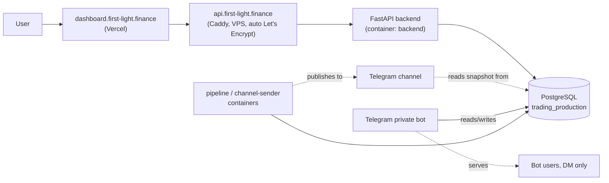

# System Overview — First Light / Donchian Breakout Screening Platform

> **Purpose:** the primary technical map of the system as it runs today. Read this first; every
> other document under `docs/` goes deeper on one slice of what's summarized here.
> **Source of truth:** `docker-compose.yml` + `docker-compose.prod.yml` (what actually runs),
> `deploy/vps/donchian-*.{service,timer}` (what actually schedules it), the VPS itself.
> **Last verified:** 2026-09-25, against live production and current code (not against older docs).

## 1. What this is

A daily quantitative screening platform that scans ~2,900–3,100 US equities for Donchian channel
breakouts, enriches signals with fundamentals and an XGBoost ML layer, stores everything in
PostgreSQL, and serves it through a FastAPI backend + Next.js dashboard. A companion subsystem —
**First Light** — publishes a daily post-market summary to a public Telegram channel and runs a
private, invite-only Telegram assistant bot.

## 2. Production architecture

**The Hetzner VPS (`116.203.220.219`) is the sole, authoritative production environment.** It runs
Postgres, the FastAPI backend, the Telegram bot, and every scheduled job, all as Docker containers
(`docker-compose.yml` + `docker-compose.prod.yml`), scheduled by systemd timers (see
[SCHEDULING.md](SCHEDULING.md)).

**The Windows PC that used to be production is now a frozen development/reference environment.**
Its copy of the database was migrated to the VPS and has **not** been written to since. Its 6 Task
Scheduler jobs and its `run_bot.py` process are deliberately `Disabled`/stopped — a manual rollback
path, not a warm standby. **Never re-enable a Windows writer while the VPS is active** — see
[../operations/ROLLBACK.md](../operations/ROLLBACK.md) for why the databases have diverged and what
that means for any Windows fallback.

## 3. The five execution paths

The system is not one monolithic pipeline — it's five independent paths that happen to share one
database. Confusing them (e.g. assuming the Telegram bot needs the ML pipeline to run) is the most
common way to misjudge what actually needs to succeed for something to work.

| # | Path | Trigger | Depends on | Detail |
|---|---|---|---|---|
| 1 | **Market-data ingestion** | `donchian-pipeline.timer` (23:45 / 01:00 Israel) or `donchian-firstlight1-prices.timer` (05:00) | Price/fundamentals vendors (yfinance/Alpaca/Tiingo) | `mechanism/data_updaters/` |
| 2 | **Full screening + ML pipeline** | Same `donchian-pipeline.timer`, steps 3–12 | Path 1's data already landed | `mechanism/screeners/`, `ml_training/` — see below |
| 3 | **Telegram post-market publishing** | `donchian-pipeline.timer` (inline) + `donchian-postmarket-retry.timer` (bounded retry) | Only Path 1's price data (steps 3–12 of Path 2 are **not** required) | [TELEGRAM_PUBLISHING.md](TELEGRAM_PUBLISHING.md) |
| 4 | **Telegram private assistant bot** | `donchian-bot.service`, continuous | The daily digest snapshot (`digest_stocks`) already existing | `mechanism/alerts/run_bot.py` |
| 5 | **Dashboard API + UI** | Always running (backend/frontend containers) | Whatever data currently exists in Postgres — degrades gracefully, never blocks on a pipeline run | `backend/`, `frontend/` |

Two more paths run independently of all of the above: the **earnings-today post**
(`donchian-earnings-today.timer`) and the **midday/evening notices** (`donchian-notice-*.timer`) —
neither touches market data or the post-market package. See [SCHEDULING.md](SCHEDULING.md).

## 4. Component ownership map

| Directory | Owns | Does NOT own |
|---|---|---|
| `frontend/` | The Next.js dashboard UI, deployed to Vercel. Single API client: `frontend/src/services/api.ts`. | Any business logic — it only renders what the backend returns. |
| `backend/` | The FastAPI app: `main.py` (DB pool, CORS, dashboard endpoints inline) + `routers/`/`services/` pairs (one per feature) + `auth/` (JWT + emailed 2FA). | Data ingestion, ML training, Telegram sending. It reads Postgres; it never writes market data. |
| `mechanism/` | The data pipeline: `data_updaters/` (price/fundamentals ingestion), `screeners/` (Donchian breakout detection — `multi_timeframe_screener.py` is the live one), `shared/` (config, DB pool, market calendar), and `alerts/` (**everything Telegram**: digest/board/gainers/health builders, the post-market publisher, the bot, access control). | Serving the dashboard API, training ML models. |
| `ml_training/` | The **training** pipeline: feature engineering (`features/price_features.py`), dataset builds (`data_preparation/build_dataset.py`), model training + the promotion gate (`models/momentum_predictor.py`). | Live inference — that's `mechanism/ml_enhancement/`, a separate package on purpose (training and serving must not share mutable state). |
| `mechanism/ml_enhancement/` | **Live inference only**: `ml_signal_enhancer.py` loads the newest gate-passing model (by `_meta.json`, not just newest-by-filename) and scores live signals through the same feature module `ml_training` used to train it. | Training, dataset building — it only consumes what `ml_training/` produced. |
| `deploy/` | Everything that runs the VPS itself: `deploy/vps/` (deploy/rollback scripts, the firewall unit, and — since the 2026-09-25 audit — the tracked systemd unit/timer files), `deploy/db/` (backup/restore tooling). | Application code. |
| `docker/` | The two Caddy configs (`Caddyfile`, `Caddyfile.prod`) and `.env.example` (local Compose validation only). | — |
| `.github/workflows/` | `ci.yml` (auto, every push/PR) and `cd.yml` (manual only, `workflow_dispatch`). | Any automatic production deployment — mechanism-image rollout is always a manual VPS step by design. |

## 5. Where should new work go?

| If you're building… | It belongs in… |
|---|---|
| A new dashboard API endpoint | `backend/routers/` + `backend/services/` (a new pair, matching the existing ones) |
| A new dashboard UI page/component | `frontend/src/app/` or `frontend/src/components/` |
| A new price/fundamentals data source or updater | `mechanism/data_updaters/` |
| A change to breakout detection | `mechanism/screeners/multi_timeframe_screener.py` — the only screener actually used; see [../../CLAUDE.md](../../CLAUDE.md) for the confirmed-dead alternatives not to build on |
| A new Telegram channel post or a change to the post-market package | `mechanism/alerts/` — read [TELEGRAM_PUBLISHING.md](TELEGRAM_PUBLISHING.md) first; the per-kind idempotency contract must be preserved |
| A new ML feature or training target | `ml_training/features/` + `ml_training/models/momentum_predictor.py` |
| Wiring a new/updated model into live scoring | `mechanism/ml_enhancement/ml_signal_enhancer.py` — never make training and serving import each other's mutable state |
| A database schema change | A new migration file at the repo root of `mechanism/` (`add_<thing>_tables.sql`), added to `docker-compose.yml`'s numbered init-mount list **in order** — see [DATABASE.md](DATABASE.md) |
| A new scheduled job | A new systemd unit, installed on the VPS **and** committed to `deploy/vps/` — see [SCHEDULING.md](SCHEDULING.md) for the snapshot-not-live-sync workflow |
| Deployment/infrastructure changes | `deploy/`, `docker-compose*.yml`, `.github/workflows/cd.yml` — see [CI_CD.md](CI_CD.md) |

## 6. Critical safety invariants

These hold regardless of what task you're doing — see [../../CLAUDE.md](../../CLAUDE.md) §12 for
the full list and reasoning:

- VPS `trading_production` is the only authoritative database. Never enable a Windows writer while
  it's active.
- `PROD_SENDING_ENABLED` gates all real Telegram channel sends — never bypass it casually.
- Telegram publishing must stay idempotent (`telegram_post_delivery`'s atomic claim, never
  check-then-send).
- The post-market package never depends on the heavy pipeline stages (weekly/monthly/fundamentals/
  quarterly/screener/ML).
- Database migrations are additive/forward-safe only, applied to production manually and verified.
- Never print, log, commit, or expose a real secret value.

## 7. Where to go next

- [CODEBASE_AUDIT.md](CODEBASE_AUDIT.md) — the executable architecture map: entrypoints, per-file classification (ACTIVE/LEGACY/DEAD, with evidence), test coverage gaps, AI-reachability findings, a ranked cleanup plan.
- [DATABASE.md](DATABASE.md) — schema by functional domain, migration model, CI validation.
- [TELEGRAM_PUBLISHING.md](TELEGRAM_PUBLISHING.md) — the full post-market flow, idempotency contract.
- [SCHEDULING.md](SCHEDULING.md) — every production timer, verified against the tracked systemd files.
- [CI_CD.md](CI_CD.md) — how a commit becomes a running production container.
- [../operations/DEPLOYMENT.md](../operations/DEPLOYMENT.md), [../operations/BACKUPS.md](../operations/BACKUPS.md), [../operations/ROLLBACK.md](../operations/ROLLBACK.md)
- [../dev/LOCAL_SETUP.md](../dev/LOCAL_SETUP.md), [../dev/TESTING.md](../dev/TESTING.md), [../dev/ENVIRONMENT.md](../dev/ENVIRONMENT.md)
