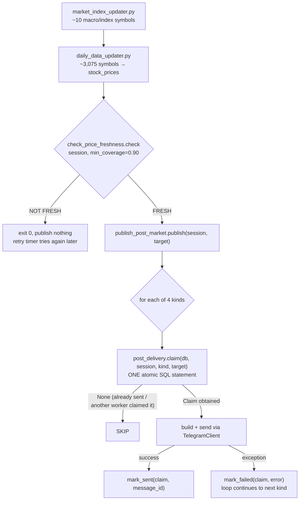

# Telegram Publishing — the post-market package

> **Purpose:** the complete, current flow for how First Light's daily channel posts get published,
> and the idempotency contract that makes it safe to retry. This subsystem changed significantly on
> 2026-09-25 — do not trust any document dated before that for how this actually works.
> **Source of truth:** `mechanism/alerts/publish_post_market.py`, `mechanism/alerts/post_delivery.py`,
> the `telegram_post_delivery` table (see [DATABASE.md](DATABASE.md) §4).
> **Last verified:** 2026-09-25 — a real controlled production replay (one send, one no-op retry),
> plus automated tests including two independent real two-thread concurrency races (one within
> `publish_post_market.py`, one across it and `send_channel_posts.py` — see §5b), full green in CI.

## 1. What this subsystem is, and is not

**This document covers exactly four things, published together as "the post-market package":**
Daily Digest, Momentum Board, Top Gainers, Market Health. It does **not** cover — see §6 for why
each is a fully separate system:

- the pre-market **earnings-today post**
- the twice-daily **disclaimer/promo notices**
- the **private Telegram assistant bot**

Confusing any of these with the post-market package is the single most likely way to misjudge this
subsystem — they use the same `TelegramClient` gateway, and nothing else.

## 2. The complete flow



Two callers run this exact same code path:

1. **`automation_pipeline.sh`**, right after its own steps 1–2 (market index + daily price update)
   and its own freshness check, calling `publish_post_market.py --skip-update` — the data is already
   fresh, so this call only re-derives the target session and does the claim-and-send loop. Called
   twice: once right after step 2, once again as step 13 (a retry, reached only once every
   weekly/monthly/fundamentals/quarterly/screener/ML step has already succeeded).
2. **`donchian-postmarket-retry.timer`** (23:45 Israel, then every ~20 minutes through 06:00),
   **without** `--skip-update` — this script refreshes `market_index_updater.py` +
   `daily_data_updater.py` itself, checks freshness, and publishes. It deliberately never touches
   the heavy pipeline stages, so a 20-minute retry cadence stays cheap.

**Exit codes**: 0 in every "nothing wrong, just nothing to do right now" case (no completed session
yet, data still stale, everything already delivered) — this is what makes the retry timer a safe
no-op once done, with no special-casing in the `.service` file. Exit 1 only for a genuine
operational failure (a post that was claimed but failed to send).

## 3. The four posts

| Kind | Builder | Required data | Delivery identity |
|---|---|---|---|
| `daily_digest` | `send_daily_digest.py` (subprocess — unchanged, proven code) | `stock_prices` (today) + `market_index_prices` + `daily_fundamentals` (market-cap tags only) | 1 photo + up to several list messages; also writes `digest_runs`/`digest_stocks` — everything below reads from this |
| `momentum_board` | `mechanism/alerts/channel_content.post_board()` | `stock_prices` (today) + `digest_stocks` from the **prior 5 sessions** — i.e. depends on earlier days' successful digests, not today's | 1 message (or photo, if it renders one) |
| `top_gainers` | `mechanism/alerts/channel_content.post_top_gainers()` | The same rows `analyse_universe()` already computed for the digest — no new calculation | 1 message |
| `market_health` | `mechanism/alerts/channel_content.post_health()` | `market_stats.health()` over the same `stock_prices` rows | 1 message |

**Eligibility**: all four become eligible at the same moment — the instant `check_price_freshness`
passes for a session. There is no separate "wait longer for this one" logic between them.

**Retry behavior**: each kind is claimed and sent independently (§4). A failure in one (e.g.
`top_gainers`) does not block or retry the others — `market_health` is still attempted in the same
loop iteration even if `top_gainers` just failed, and a later call only re-attempts the kind(s) still
missing.

**Confirmed by reading every data dependency directly**: none of the four kinds touch
`technical_indicators`, the weekly/monthly tables, the full daily-fundamentals refresh, the
multi-timeframe screener, or any ML step. This is *why* the lightweight retry path can run
independently of the full 13-step pipeline — see [SCHEDULING.md](SCHEDULING.md).

## 4. `telegram_post_delivery` — the idempotency contract

Full schema and design rationale: [DATABASE.md](DATABASE.md) §4. The essential contract, from the
caller's point of view:

```python
claim = post_delivery.claim(db, session, kind, target)   # None, or a Claim
if claim is None:
    continue   # already sent, or another process's claim is still fresh — SKIP, do not send
try:
    message_id = send(kind, ...)
    post_delivery.mark_sent(db, claim, message_id)
except Exception as e:
    post_delivery.mark_failed(db, claim, str(e))          # never marks 'sent'; next call can reclaim
```

- **Concurrency protection** is the database's `UNIQUE(market_session, post_kind, target)`
  constraint plus a single atomic `INSERT ... ON CONFLICT ... DO UPDATE ... WHERE <reclaimable>` —
  never a check-then-insert pattern in application code. Verified by a real two-thread race
  (`test_two_concurrent_claims_only_one_wins`): exactly one winner, every time.
- **Partial-send recovery**: if digest + board sent but top_gainers failed, a later call skips
  digest/board (already `'sent'`) and only re-attempts top_gainers. Verified by
  `test_partial_failure_then_retry_only_attempts_the_missing_kinds`.
- **Stale-reservation recovery**: a `'reserved'` row whose claimant crashed before calling
  `mark_sent`/`mark_failed` becomes reclaimable after `RECLAIM_AFTER_MINUTES` (10). A `'failed'` row
  is reclaimable immediately — no staleness wait needed, since a failure already proves the prior
  attempt is over.
- **`market_session` is always explicit** — see [DATABASE.md](DATABASE.md) §4 for why this matters
  across the Israel-local midnight rollover.

## 5. `PROD_SENDING_ENABLED`

The single production-posting safety gate, read by `mechanism/alerts/telegram_client.py`'s
`PROD_SWITCH` constant (`os.getenv("PROD_SENDING_ENABLED", "").strip() == "1"`). While it is not
`1`, `TelegramClient.from_env("prod", dry_run=False)` raises — nothing can send to the real channel,
regardless of what the rest of this pipeline decides is eligible. This is orthogonal to
`telegram_post_delivery`: the lock decides *whether sending to prod is allowed at all*; the delivery
table decides *what's already been sent, given that it is*.

## 5b. `send_channel_posts.py` — the other caller of the same claim mechanism

`mechanism/alerts/send_channel_posts.py` (an operator-facing manual/ad-hoc sender, traced in full for
Phase 4A item 4) can also send `momentum_board`, `top_gainers`, and `market_health` — the three
`channel_content.py`-built kinds, not `daily_digest`. Before 2026-09-25 it sent these directly via
`TelegramClient` with no `post_delivery` claim at all, meaning a manual run of this script could
double-send a kind `publish_post_market.py` had already delivered for the same session, or race a
concurrent retry-timer invocation with no database-level guard between them.

Fixed by routing every claimable kind through the same `post_delivery.claim()`/`mark_sent()`/
`mark_failed()` contract as §4, via a new `send_claimable()` helper — **not** a second
implementation of the claim pattern. The one behavior difference from `publish_post_market.py`:
`send_channel_posts.py --to owner` (the debug/preview target) is intentionally exempted from
claiming, since "owner" sends are never subject to production idempotency in the first place — only
`--to dev`/`--to prod` go through the claim. This closes the invariant stated in
[CLAUDE.md](../../CLAUDE.md) §8: **no sender may deliver any of the four standard posts without the
same per-session/per-kind claim.** Verified by a real two-thread race between `post_delivery.claim()`
and `send_channel_posts.send_claimable()` (`test_post_delivery.py`) — exactly one winner across both
call sites, every time.

## 5c. Canonical post-kind identifiers (unified 2026-09-25)

Before this date, the same three posts were spelled two different ways depending on which module you
were reading: `channel_content.Post.kind` used `"board"`/`"health"`, while `telegram_post_delivery`
and `publish_post_market.py`'s claim table already used `"momentum_board"`/`"market_health"`. This
made `POST_MARKET_KINDS` a real (non-identity) translation table and was a standing hazard for any
new code that assumed the two vocabularies were interchangeable.

Unified on the delivery-table's names (the harder one to rename, since it's real historical ledger
data) — canonical kind strings, used everywhere now: `daily_digest`, `momentum_board`, `top_gainers`,
`market_health`. `channel_control.py`'s `KIND_LABELS` keeps both the old (`"board"`, `"health"`) and
new spellings mapped to the same human-readable label, so historical `telegram_messages`/audit rows
written before the rename still render correctly in the Telegram Control Center — this is a
deliberate, permanent backward-compat mapping, not a migration to later remove.

## 6. Relationship to `telegram_messages`

`telegram_messages` (see [DATABASE.md](DATABASE.md)) is the ledger every real **channel** send,
edit, delete, and pin passes through, written automatically by `TelegramClient`'s attached
`LedgerRecorder` — this is what backs the Telegram Control Center dashboard page (`/telegram`).
`telegram_post_delivery` is unrelated in purpose: it exists to answer "should I even attempt this
send," not "what did I send." A successful post-market send writes to *both* — once via
`mark_sent()` (delivery state) and once automatically via the client's ledger hook (message content
for the dashboard).

## 7. Remaining role of `session_state.json`

See [DATABASE.md](DATABASE.md) §5 for the full comparison. In short: `data/session_state.json` still
gates the *full pipeline's* own "have I processed this session" decision (key `pipeline`), and is
kept as a secondary safety net inside `send_daily_digest.py`/`send_channel_posts.py` (keys like
`digest:prod`, `posts:prod`) — but it is **not** what the post-market package itself relies on for
per-kind delivery state. Don't assume the two are interchangeable.

## 8. What this is NOT — three systems that look similar but aren't

| System | Script | Timer | Depends on the post-market package? |
|---|---|---|---|
| **Earnings-today post** | `mechanism/alerts/send_earnings_today.py` | `donchian-earnings-today.timer` (10:00 Israel) | No — fully independent script, timer, and gate (`market_calendar.is_trading_day()` keyed by the NY calendar date, not `check_price_freshness`) |
| **Midday/evening notices** | `mechanism/alerts/send_channel_notices.py --slot 1|2` | `donchian-notice-midday.timer` / `donchian-notice-evening.timer` | No — a disclaimer reminder + assistant promo, unrelated to market data entirely |
| **Private assistant bot** | `mechanism/alerts/run_bot.py` | `donchian-bot.service` (continuous, not a timer) | Reads `digest_stocks` (written by the digest post above) for "today's lists," but never sends to the channel and is never itself part of the claim/retry loop above |

A future change to any of these three does not need to touch `publish_post_market.py` or
`post_delivery.py` at all, and a future change to the post-market package does not need to touch any
of these three.

## 9. Known residual limitation (accepted, not a bug to silently fix)

`daily_digest` is invoked as a subprocess rather than refactored in-process, so its own internal
multi-message send (1 photo + up to several list messages) is **not** itself sub-divided by
`telegram_post_delivery` — if that subprocess sends message 1 of 3 and then crashes, a retry of the
`daily_digest` *kind* re-runs the whole subprocess and could re-send message 1. This was a deliberate
scope decision when the redesign was built (the specification named exactly 4 kinds, not finer
sub-parts) — worth knowing about, not something to "fix" as a side effect of unrelated work.
