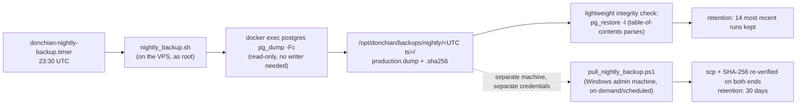

# Backups — production database

> **Purpose:** a practical reference for how production is backed up, verified, and restored — and
> an honest statement of what is and isn't covered yet.
> **Source of truth:** `deploy/db/nightly_backup.sh`, `deploy/db/pull_nightly_backup.ps1`,
> `deploy/db/verify_restore.sh`, `deploy/db/donchian-nightly-backup.{service,timer}`.
> **Last verified:** 2026-09-25 (Phase 4A: the unit files' duplicate copy under `deploy/vps/` was
> removed this pass — `deploy/db/` is now the single tracked location, confirmed still byte-identical
> to the live VPS units before the removal).

## 1. What runs automatically

- **On the VPS**: `donchian-nightly-backup.timer` fires at 23:30 UTC (note: **not** an
  `Asia/Jerusalem`-tagged timer like every other one — see [../architecture/SCHEDULING.md](../architecture/SCHEDULING.md)
  §2 for why that's a known, low-priority inconsistency). `nightly_backup.sh`:
  1. Confirms the postgres container is actually running (fails loudly if not — never silently skips).
  2. `docker exec ... pg_dump -U trading_user -d trading_production -Fc -Z 6` — a compressed custom-format
     dump, read-only, no writer needs to stop.
  3. Copies the dump out of the container, then runs `pg_restore -l` against it as a cheap integrity
     check (catches truncation/corruption without a full restore).
  4. Writes a SHA-256 checksum file and self-verifies it (`sha256sum -c`) before considering the run
     successful.
  5. `chmod 700`/`600`, `chown root:root` on the output directory.
  6. Retention: deletes runs older than `RETAIN_DAYS` (default 14) — **only after** the current run
     has already succeeded, so a broken run never triggers deletion of the last good one.
  7. Appends one line (`OK` or `FAILED <reason>`) to `/opt/donchian/logs/nightly_backup.log` on every run.

- **Off the VPS**: `pull_nightly_backup.ps1`, run from the Windows admin machine (manually today —
  not itself wired to a Windows Task Scheduler job or any other automatic trigger), pulls the latest
  successful nightly directory over `scp`, re-verifies the SHA-256 on both ends, sets restrictive
  ACLs, and retains 30 days locally. It is idempotent (skips a directory it's already pulled) and
  read-only on the VPS side.

## 2. Known, unresolved limitation — do not treat this as solved

**The off-box copy currently lands on the same Windows machine that also hosts the frozen
former-production database.** That machine is a single point of failure for *both* the live backup
history and the pre-migration reference copy — a lost or compromised Windows machine could still
mean losing every independent copy of production data that exists outside the VPS itself. There is
no object-storage (S3/B2/etc.) leg today, and no credential for one exists yet. This is a real,
open risk (tracked as P1-4 in the 2026-09-25 audit) — treat it as unresolved until a genuinely
independent third location exists, not as "backups are handled."

## 3. Full restore-and-verify drill (`verify_restore.sh`) — available, not scheduled

`deploy/db/verify_restore.sh <backup_dir> [backend_image_tag]` proves a backup is not just present
but actually *restorable and usable*, without touching the running production stack:

1. Re-verifies the SHA-256.
2. Restores into a **disposable** Postgres container on an `--internal` Docker network (no published
   ports, no outbound internet, its own throwaway volume) — never the real production instance.
3. Compares exact per-table row counts against the counts captured **in the same transaction** as
   the original dump.
4. Compares schema object counts (tables, views, indexes, constraints by type) and sequence
   positions; asserts no `NOT VALID` constraints slipped through.
5. Runs the deployed backend image (an immutable, pinned tag) against the restored copy — container
   health, a real `/api/health` call, and the full auth smoke test (`deploy/vps/auth_smoke.sh`).
6. Tears down every container/network/volume it created; writes a report next to the dump.

**Important gap, found while writing this document, not previously flagged elsewhere:**
`verify_restore.sh` reads an `inventory.json` file (server version, exact per-table row counts,
schema object counts) to know what to compare against. That file is produced by
`deploy/db/backup_production.py` — the tool used for the one-time Gate 1 migration backup — **not**
by `nightly_backup.sh`, which only writes `production.dump` + `production.dump.sha256`. As written,
`verify_restore.sh` cannot be pointed directly at a routine nightly backup directory without an
`inventory.json` alongside it. There is currently no systemd timer scheduling `verify_restore.sh` at
all — it exists as an on-demand tool, last known to have been exercised during the Gate 1 migration
itself, not as a recurring drill against the nightly automated backups. **Classify this as a real,
moderate-severity gap** (routine backups get a lightweight integrity check, not a full restore
drill) rather than assuming the thorough drill covers the automated nightly path — it does not,
today, without manual adaptation.

## 4. `backup_production.py` — the migration-era tool, still available

`deploy/db/backup_production.py` does a `REPEATABLE READ, READ ONLY` snapshot dump + exact per-table
row counts captured in the same transaction, writing `production.dump` + `inventory.json` +
`production.dump.sha256`. Its own docstring still says it "runs on the machine that hosts the
current production Postgres (the owner's Windows PC today)" — that line is stale prose from before
the VPS migration; the tool itself still works and is the one that produces the `inventory.json`
shape `verify_restore.sh` expects. Not wired into any current schedule.

## 5. If you need to actually restore production

See [ROLLBACK.md](ROLLBACK.md) §4 for the decision framework (when a restore is the right call vs.
a smaller fix). The mechanical steps are exactly what `verify_restore.sh` already automates against
a disposable copy — the only difference for a real restore is doing steps 2–3 (minus the
disposable-network isolation) against the actual `donchian-screener-postgres-1` container, which
requires stopping every writer first. This is a Gate-1-adjacent, high-blast-radius operation —
never do it without explicit approval and a fresh backup taken immediately beforehand.
